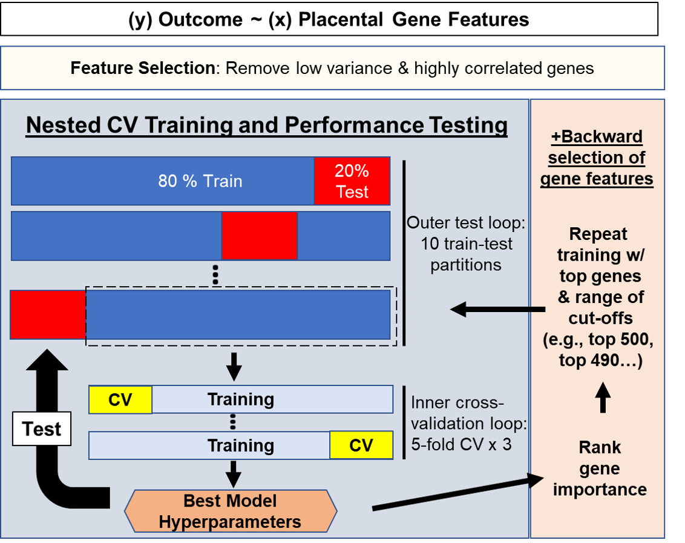
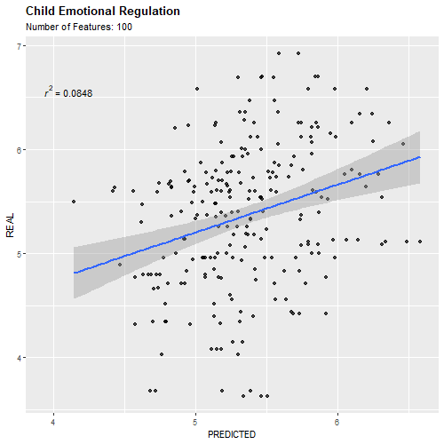
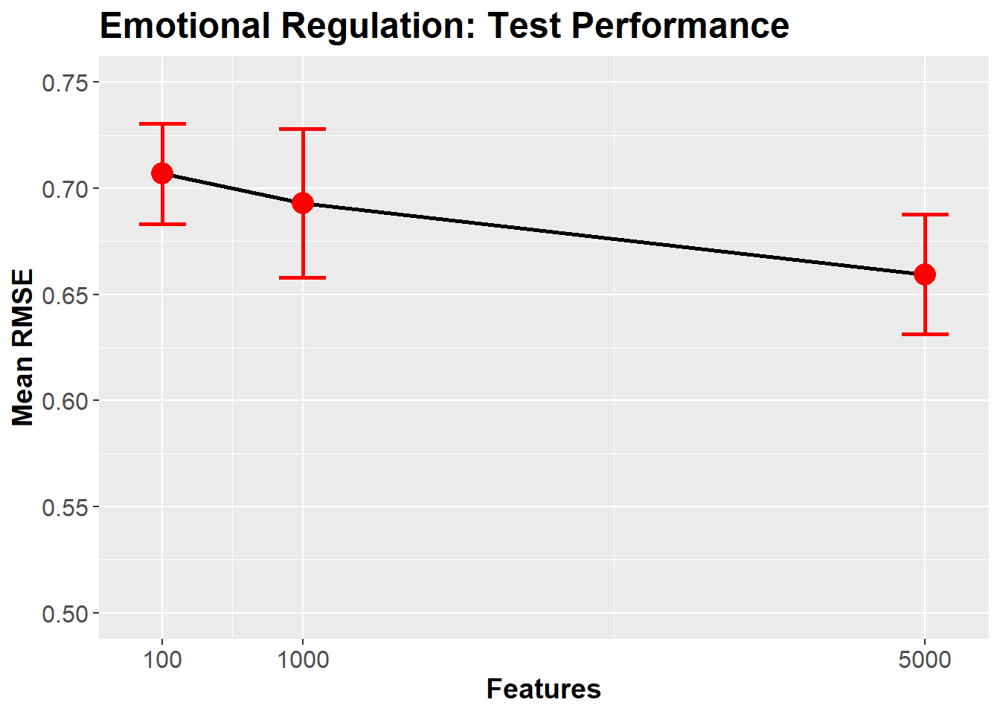
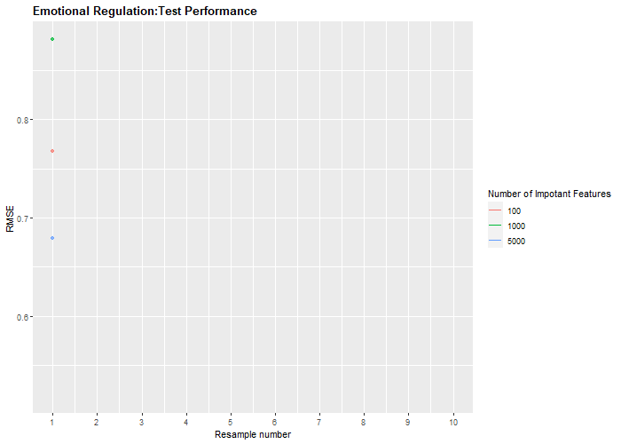

# Supervised Regression Modelling


This is the basic framework. Nested CV will allow for using several training-test paritions in parallel in the outer loop. 
The inner-loop features cross-validation with 5 folds of the training data. Finally, backward selection of gene features
allows you to build new models with a specified amout of "most important" features as determined from the training model.


## Training and Testing

Here we are going to use placental gene expression to predict maternal age and emotional regulation in children.


```r
# Load necessary packages
suppressPackageStartupMessages({
library(caret)
library(DESeq2)
library(e1071)
library(pROC)
library(plyr)
library(stringr)
library(dplyr)
library(mboost)
library(gbm)
library(DESeq2)
library(dplyr)
library(pls)
library(ggplot2)
library(ggpubr)
library(gganimate)
library(gapminder)
library(cowplot)
library(directlabels)
library(gifski)
library(transformr)
library(RUncommon)

                              })


working.dir="C:/Users/grrompala/Desktop"  # working directory
setwd(working.dir)

# Load in your gene counts and metadata 
counts <- read.csv("counts.csv",header=T,row.names=1) # raw gene counts for each subject
meta <- read.csv("meta.csv",header=T,row.names=1) # metadata with 2 outcomes we will predict for each subject

head(counts[1:10,1:10])
```

```
##            S_1  S_10 S_100 S_103 S_106 S_107 S_108 S_109 S_10Q  S_11
## A1BG-AS1    16    16    16    14    23    15    26    16    13     9
## A2M      30620 14070 24203 31400 43652 30419 34490 22477 33795 10351
## A2M-AS1     20    18    38    28    17    27    27    29    22    12
## A2ML1      165    22     7     4    31     8    14    10    13    18
## A2MP1        3     3    18    16     5     1    19    23    11    12
## A4GALT    1168   516   702   607  1147   462   687   822   628   622
```

```r
head(meta[1:10,])
```

```
##       STAI_TTO      REG
## S_1         20 6.583333
## S_10        34 4.345238
## S_100       36 4.960000
## S_103       27 6.232143
## S_106       41 5.540000
## S_107       31 4.600000
```

```r
# Filter and normalize gene counts: we will use rowMeans>10 as a filter
counts <- counts[rowMeans(counts)>10,]
counts <- varianceStabilizingTransformation(as.matrix(counts))
counts <- t(counts)
# Filter metadata and subjects that are missing metadata for mom age or child emotional regulation
```

Here we will employ common techniques employed to reduce number of predictors that may be introducing noise


```r
# Filter counts by coefficient of variance
coef.var<-apply(subset(counts),2,function(x)sd(x)/mean(x)) # calculate coefficent of variance (CV)
genes2keep<-names(coef.var)[which(coef.var>0.05)]      # extract genes to keep after CV threshold
coef_counts<-counts[,c(genes2keep)]     # filter by genes to keep

#paste("Number of Genes Remaining:",length(colnames(coef_counts)),sep=" ")

# Filter counts using dimensionality reduction
CorrelationMatrix<-cor(coef_counts[,-1]) 
highlyCorrelated<-findCorrelation(CorrelationMatrix,cutoff=0.9,names=TRUE) # Filters genes with correlation R values greater than 0.8 (keeping the gene with least co-linearity)
COUNTS <-coef_counts[,setdiff(colnames(coef_counts),highlyCorrelated)]
paste("Number of Genes Remaining:",length(colnames(COUNTS)),sep=" ")
```

```
## [1] "Number of Genes Remaining: 5885"
```


```r
set.seed(1097) # Set seed for reproducible results!
```

Now, we will loop through our two outcome variables, 
building a partial least squares regression model for each


```r
#global-options,include=TRUE,warning=FALSE}
#knitr::opts_chunk$set(warning=FALSE,message=FALSE,include=FALSE) # Settings to repress warning messages in the chunk

options(width = 60)

outcomes <- colnames(meta) # should be mother's trait anxiety and emotional regulation as vector
model <- c("glmnet") # set model
variables <- c(100,1000,5000) # Set how many ranked important variables to rebuild model with


# Initialize data summaries
final.summary <- data.frame(Buffer=character(),stringsAsFactors = FALSE)
all.predictions <- data.frame(holder=character(),                          stringsAsFactors=FALSE)
resample.summary <- data.frame(holder=character(), stringsAsFactors=FALSE)
varImp.summary <- data.frame(blank="")


# Looping through both traits and both features cut-offs (100,1000)

  for (trait in outcomes)
  {
   metaF <- meta %>% filter(is.na(meta[[trait]])==F) # filter out NAs from outcome variable
   counts <- COUNTS[rownames(metaF),] # filter subjects in counts with new metadata
   working.META <- metaF[[trait]] # filters metadata for outcome 
   names(working.META) <- rownames(metaF)
   
   train.parts <- createDataPartition(working.META,p=0.8,list=TRUE,times=10) # makes training and test sets 
   #(Here I am making 25 training-test splits of 80% train and 20% test)
   
   cv.settings <- trainControl(method="repeatedcv",number=5,repeats=3) # cross-validation with
   #splits data into 5 folds and repeats this three times

   # Train regression model for each of your partitions
   
   Regression.Models <-lapply(train.parts, function(L){
   X.train <- counts[L,]
   Y.train <- working.META[L]
   train.parts <- rownames(X.train)
   model.one <-train(y=Y.train,
                     x=X.train,
                     method=model,
                     trControl = cv.settings,
                     trace=FALSE)
   importance<- varImp(model.one)$importance # outputs variables ranked by importance score
   TrainID<-names(Y.train)
   return(list(MODEL=model.one,TrainID=TrainID,importance=importance,train.parts=train.parts)) })

   # Empty DFs to iterate through different feature variable cut-offs
   df <- data.frame(New=character(), stringsAsFactors=FALSE)
   predictionsT <- data.frame(New=character(), stringsAsFactors=FALSE)
   resamplesT  <- data.frame(New=character(), stringsAsFactors=FALSE)
   
    for (import_num in variables) # Choose a few important variable cutoffs
    {
    
     VarImport.Models <- lapply(Regression.Models, function(L){
     importance <- L$importance
     varImps <- rownames(importance[order(importance$Overall,decreasing=T),,drop=FALSE])[1:import_num]
     varImps <- str_remove_all(varImps,"`")
     train.parts <- L$train.parts
     X.train<- counts[train.parts,varImps]
     Y.train<- working.META[train.parts]
     model.one <-train(y=Y.train,
                       x=X.train,
                       method=model,
                       trControl = cv.settings,
                       trace=FALSE)
     TrainID<-names(Y.train)
     return(list(MODEL=model.one,TrainID=TrainID,varImps=varImps))})

     # Compile model results
     VarImport.Models.Results <- lapply(VarImport.Models,function(L){
     ok<- getTrainPerf(L$MODEL)
	   return(ok) })
     RM.Results <- ldply(VarImport.Models.Results,rbind)

     # Use trained model on test dataset
     Regression.Predictions<-lapply(VarImport.Models, function(L){
     TrainID<-L$TrainID
     TestID<-setdiff(rownames(counts),TrainID)
     MODEL<-L$MODEL
     varImps <- L$varImps
     X.test<- counts[TestID,varImps]
     Y.test<-working.META[TestID] 
     model.preds<-predict(MODEL,X.test)
     table.preds<-cbind.data.frame(PRED=model.preds,REAL=Y.test)
     table.preds$SampleID<-rownames(table.preds)
     RMSE <- RMSE(model.preds,Y.test)
     correlation <- cor(model.preds,Y.test)
     return(list(testRMSE=RMSE,table.preds=table.preds,testR=correlation))})
    
     # Generate best RMSEs and correlation R values for all test partitions 
     RMSE <- lapply(Regression.Predictions,function(L){
     RMSE <- L$testRMSE
     return(RMSE)})
     RMSE <-do.call("rbind.data.frame",RMSE)
     colnames(RMSE) <- NULL
      
     # Get correlation between predictions and real scores for each train-test partition
     corr <- lapply(Regression.Predictions,function(L){
     corr <- L$testR
     return(corr)})
     corr <-do.call("rbind.data.frame",corr)
     colnames(corr) <- NULL

     # Compile results for each resample
     results <- cbind(RM.Results,RMSE,corr)
     results$trait <- trait
     results$var.num <- import_num
     resamplesT <- rbind.fill(resamplesT,results)

     ## Compile results summarizing each resample per trait and number of features
     RM.Result <- RM.Results[,2:4]
     averages <- cbind(RM.Result,RMSE,corr)
     averagez <- colMeans(averages)
     averages <- append(trait,averagez)
     averages <- append(import_num,averages)
     x <- data.frame(t(averages))
     colnames(x)[1:2] <- c("Feature.number","Trait")
     df <- rbind.fill(df,x)

     ## Bind and write all predictions out to file
     Regression.Predictions <- lapply(Regression.Predictions,function(L){
                               Regression.Predictions <- L$table.preds
                               return(Regression.Predictions)})
     
     Regression.Predictions <- mapply(`[<-`, Regression.Predictions, 'Partition', value = names(Regression.Predictions), SIMPLIFY = FALSE)
     Regression.Predictions <- bind_rows(Regression.Predictions)
     Regression.Predictions$trait <- trait
     Regression.Predictions$feat.num <- as.factor(import_num)
     predictionsT <- rbind.fill(predictionsT,Regression.Predictions)

    # print(paste(import_num,"done",sep=" ")
    }
   
   # Write gene importance out to file
   varImp.list <-lapply(Regression.Models, function(L){
   importance<-varImp(L$MODEL)
   return(importance$importance)})
   varImp.list <- do.call("cbind",varImp.list)
   colnames(varImp.list) <- c(paste("Resample.",1:length(colnames(varImp.list)),sep=""))
   avg.varImp <- rowMeans(varImp.list)
   
   
   # Bind results for each trait used
   varImp.summary <- cbind(varImp.summary,avg.varImp)
   final.summary <- rbind.fill(final.summary,df)
   all.predictions <- rbind.fill(all.predictions,predictionsT)
   resample.summary <- rbind.fill(resample.summary,resamplesT)
   
   
  }
```

Clean up the results data frames and perhaps write results to file


```r
# remove excess
all.predictions <- all.predictions[,-c(1:2)]
resample.summary <- resample.summary[,-c(1:2)]
final.summary <- final.summary[,-c(1:2)]
varImp.summary <- varImp.summary[,-1]
colnames(varImp.summary) <- outcomes

# write.csv(final.summary[,-c(1:2)],file="Summary.REG.varImp.GLMNET.csv")
# write.csv(all.predictions[,-1],file="PREDICTIONS.REG.varImp.GLMNET.csv")
# write.csv(resample.summary,file="Resample.REG.varImp.GLMNET.csv")
# write.csv(varImp.summary,file="VarImp.summary.csv")
```

## Examining the Results

Here we depict predictions vs real values. Note all subjects are represented as we took the average prediction across all 10 test partitions.


```r
# results for emtoional regulation
ok <- ggscatter(all.predictions %>% filter(trait=="REG"),
                x="PRED",
                y="REAL",
                color="feat.num",
                add="reg.line",
                mean.point = T,
                title="Predicting Emotional Regulation from Placental Gene Expression",
                mean.point.size=9,
                palette="Set2",
                facet.by = "feat.num",
                xlab="PREDICTED VALUE",
                ylab="REAL VALUE")+
                stat_cor(method = "pearson",show.legend = F)+
                theme(plot.title = element_text(hjust = 0.5))

ok <- ggpar(ok,legend.title= "Number of Important Features",legend="bottom")
ok
```

```
## `geom_smooth()` using formula 'y ~ x'
```


The same thing here, just using gganimate


```r
p <- ggplot(all.predictions %>% filter(trait=="REG"), aes(x=PRED, y=REAL)) +
  geom_point(alpha = 0.7, show.legend = FALSE) +
  
  geom_smooth(method='lm', formula= y~x)+
   stat_smooth_func(geom="text",method="lm",hjust=0,parse=TRUE)+
 # stat_regline_equation()+
  #scale_colour_manual(values = country_colors) +
  #scale_size(range = c(2, 12)) +
  #scale_x_log10() +
  #facet_wrap(~continent) +
  # Here comes the gganimate specific bits
  labs(title="Child Emotional Regulation",subtitle = "Number of Features: {closest_state}", x = 'PREDICTED', y = 'REAL') +
  transition_states(feat.num) +
   theme(
  plot.title = element_text(face="bold")
)

animate(p, duration = 5, fps = 50, width = 500, height = 500, renderer = gifski_renderer())
```

<!-- -->

```r
#anim_save("output.gif")
```

RMSE (Root Mean Square Error) is used to evaluate test performance. This tells you the average difference between the real and predicted values (i.e,
the residual). 


```r
resample.stat <- resample.summary %>% filter(trait=="REG") %>% group_by(var.num) %>% summarise(
   mean=mean(RMSE),
   se=sd(RMSE)/sqrt(n()))

ggplot(resample.stat,aes(x=var.num,y=mean))+
   geom_line(color="black",size=1)+
   geom_point(color="red",size=5)+
   geom_errorbar(aes(ymin = mean - se, ymax = mean + se), color="red",width=300,size=1)+
   labs(title="Emotional Regulation: Test Performance", x = 'Features', y = 'Mean RMSE',hjust=0.5)+
   scale_x_continuous(breaks=c(100,1000,5000))+
   ylim(0.5,.75)+
   theme(plot.title=element_text(size=18,face="bold"),
        axis.title=element_text(size=14,face="bold"),
        axis.text.x = element_text(size=12),
        axis.text.y=element_text(size=12))
```



Showing how RMSE changed with each resampling test partition


```r
resample.summary$ID <- rep(1:10,times=6,each=1)

p <- ggplot(resample.summary %>% filter(trait=="REG"), aes(x=ID, y=RMSE,group=as.factor(var.num),color=as.factor(var.num))) +
     geom_line()+
     geom_point(alpha = 0.7, show.legend = FALSE) +
     scale_x_continuous(breaks=c(1:10))+
     scale_color_discrete(name="Number of Impotant Features")+
     labs(x="Resample number",y="RMSE",title="Emotional Regulation:Test Performance")+
     transition_reveal(ID) +
     theme(
     plot.title = element_text(face="bold")
     )

animate(p, duration = 8, fps = 50, width = 700, height = 500, renderer = gifski_renderer(),end_pause = 100)
```

<!-- -->

```r
#anim_save("output.gif")
```

Taking a look at most important variables for each trait


```r
## Sort by highest importance to lowest
#m <- varImp.summary %>% arrange(desc(REG))
#ggplot(aes(x=`car name`, y=mpg_z, label=mpg_z)) +
#geom_bar(stat='identity', aes(fill=mpg_type), width=.5)  +
#  scale_fill_manual(name="Mileage", 
 #                   labels = c("Above Average", "Below Average"), 
  #                  values = c("above"="#00ba38", "below"="#f8766d")) + 
  #labs(subtitle="Normalised mileage from 'mtcars'", 
#       title= "Diverging Bars") + 
#  coord_flip()
```


